# VINYL CUTTER

* [Machine details](#machine-details)  
* [Prep your file for cutting](#prep-your-file-for-cutting)  
* [Install the CutStudio plugin](#install-the-cutstudio-plugin)  
* [Loading vinyl into the machine](#loading-vinyl-into-the-machine)  
* [Cutting something](#cutting-something)
* [Weeding and transfer tape](#weeding-and-transfer-tape)  
* [Applying the vinyl](#applying-the-vinyl)  
* [Other resources](#other-resources)  

- - -

### MACHINE DETAILS

| Make  | Roland |
| :---- | :----- |
| Model | GX-24 |
| Software | Illustrator with CutStudio plugin |
| Min width | 2 inches |
| Max width | 27.5 inches |
| Min length | 4 inches |
| Max length | Infinite! |
| Detailed info | [Roland website](https://www.rolanddga.com/support/products/cutting/camm-1-gx-24-24-vinyl-cutter) |

- - -

### PREP YOUR FILE FOR CUTTING  
Before we can cut anything, we have to be sure the file is ready to go.

**CHECK IF EVERYTHING IS READY**  
Let's first see what the vinyl cutter is going to cut. Go to `View > Outline...`. This shows us just the outlines of the shapes, no color or stroke. What you see here is what the vinyl cutter sees!

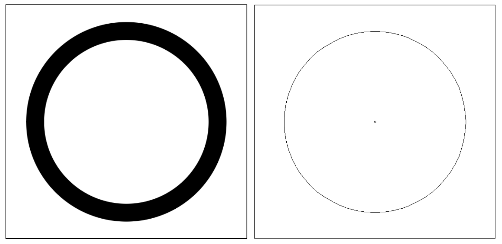

Notice the shape on the left appears to be a thick circular line but the same shape in outline mode shows that it's actually just a single line right down the middle! If we were to send this to the vinyl cutter, it would just cut the middle circle and not the outline we want. To fix this and other issues that might impact cutting, see the following steps!

**CONVERT TEXT TO OUTLINES**  
In Illustrator, text is a special object that the vinyl cutter can't directly work with. To fix this, we need to convert it to a shape. Note! This means you won't be able to edit the text any longer, so be sure to save a copy for this step!

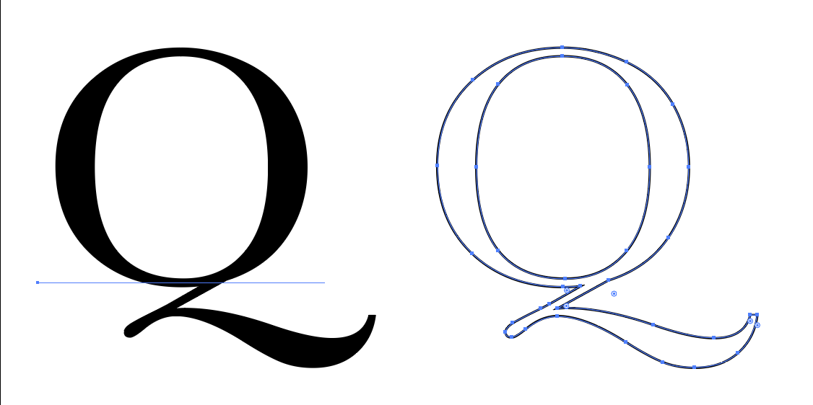

1. Go to `Select > Select All...` or `Command/Control + A`  
2. Then `Type > Create Outlines...` or `Command/Control + Shift + O`  

Your text should now be made of paths like other shapes.

**FIX OVERLAPPING SHAPES**  
The vinyl cutter will trace around all the shapes in your drawing, even if overlapping shapes look like one solid block. This will cause issues later when weeding and will leave unsightly cuts across your nice vinyl!

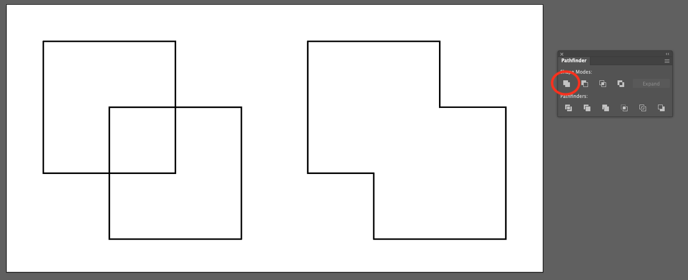

1. Select any shapes that are overlapping each other  
2. Open the `Pathfinder` tools by going to `Window > Pathfinder...`  
3. Click the button in the upper-left corner (the `Unite` function)  

**CONVERT STROKE TO FILL**  
The last thing we need to do is change any stroke (outlines) to fill (solid shapes). That's because the vinyl cutter doesn't see the stroke width, just the line that forms it.

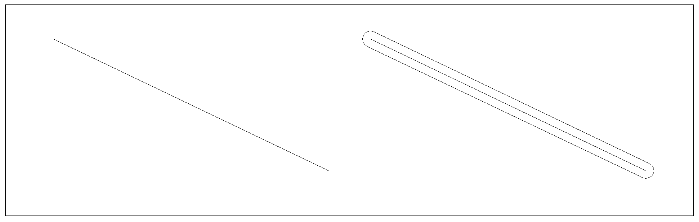

1. Select the lines you want to convert  
2. Go to `Object > Expand...`  
3. Uncheck `Fill` but be sure `Stroke` is selected  
4. Hit `Ok` and the outline should now look like a shape!  

However, Illustrator keeps the original line too, which will be cut unless we delete it...

5. Right-click and select `Ungroup`  
6. Click away and select the object again – this will give us the outlined stroke, not the line we want to delete!  
7. Go to `Select > Next object below...` and delete the line  

> Note! The same thing applies here for any shapes you made using effects, blending, etc. For those, you'll want to use `Object > Expand apperance...` instead.

- - -

### INSTALL THE CUTSTUDIO PLUGIN
Using a plugin, we can run the vinyl cutter right from Illustrator! But you'll need to install it first.

1. Open the Creative Cloud app, then search for `Roland CutStudio`...

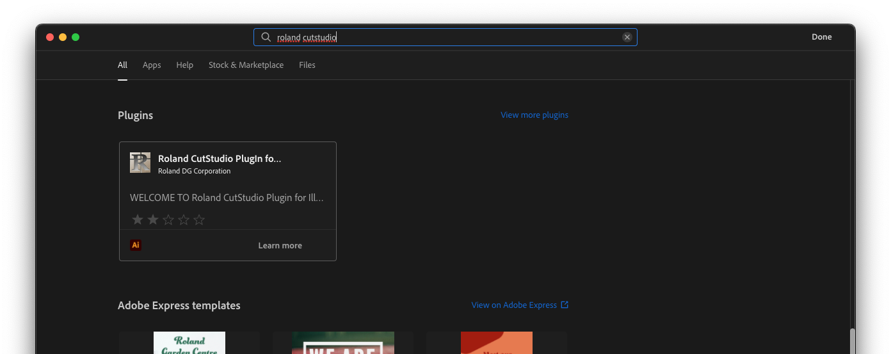

2. Click the plugin, then hit the `Get` button to install it...

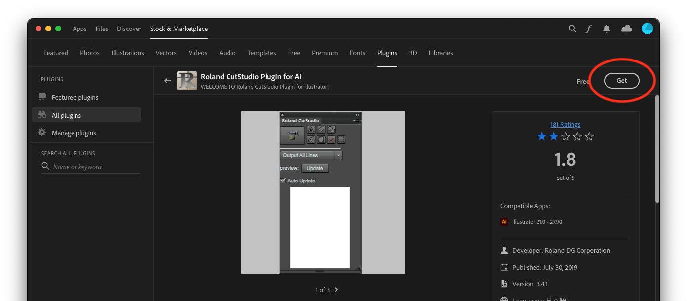

3. Check if it's properly installed by going to `Window > Extensions...`. You should see `Roland CutStudio` listed...

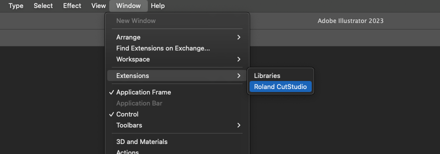

The plugin should open but without the vinyl cutter connected, you won't be able to do much with it.

- - -

### LOADING VINYL INTO THE MACHINE  
With your design ready, it's time to load the vinyl into the machine! We supply vinyl in long rolls, but you can also use smaller pieces, even offcuts! Anything within the minimum size of `2 x 4 inches` will work.

> Images of this process coming soon!

1. Lift the locking lever on the left rear side  
2. If using a roll, place it on the rollers in the back and feed the vinyl into the machine; if using a sheet, just feed it in. Move the vinyl forward until it sticks out the front a bit  
3. Move the vinyl side-to-side so that both edges are within one of the white sections  
4. Make sure the vinyl is straight using the markings on the front of the machine  
5. Adjust the feed rollers so they are inside the edges of the vinyl  
6. Lock the lever in the back  

The machine should ask if you've installed a roll or sheet. Confirm and the cutter/vinyl should start moving as the machine figures out how big your piece is! You may still need to set the origin point, but we'll cover that in a bit.

- - -

### CUTTING SOMETHING  
We're finally ready to cut!

> Note! Please do not adjust any settings in the machine other than the cut force slider. We've got things dialed in for vinyl – changes could make it difficult for other folks to use the machine.

1. Connect the vinyl cutter to your computer using the USB cable  
2. Go to `Window > Extensions...` and open `Roland CutStudio` – a little window should pop up  
3. Select the `GX-24` machine  

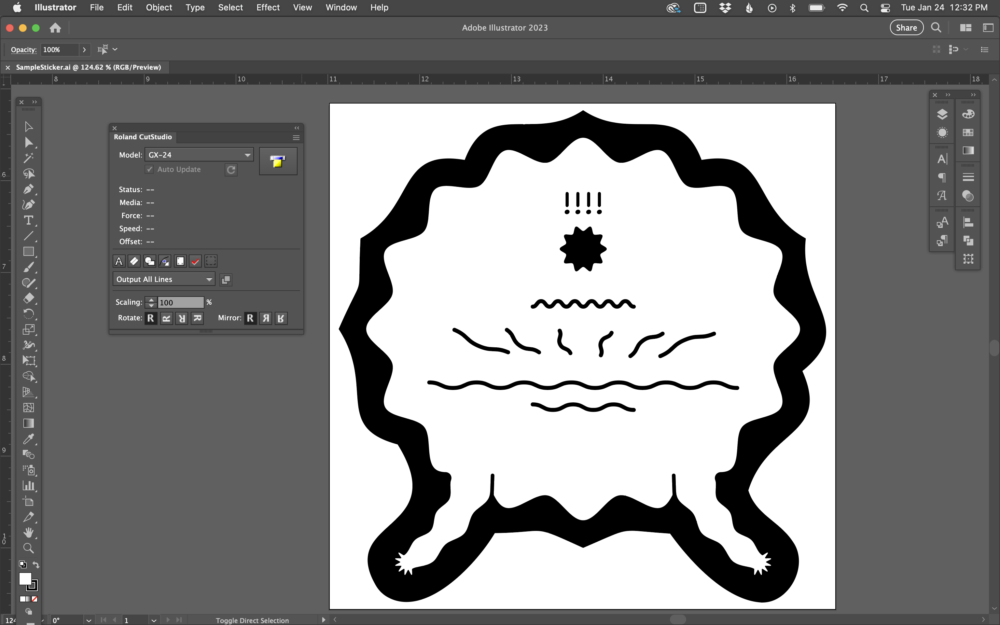

4. There are lots of other options here, but for basic cutting we're ready to go! Click the printer-looking icon in the upper-right corner  
5. This should open a new popup. The name of the vinyl cutter will be grayed out for a moment, but then will become active  

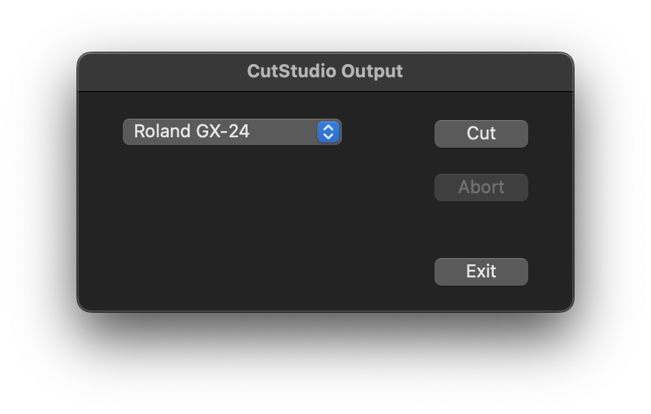

6. If you're ready to go, click `Cut` and watch the vinyl cutter spring into action!
7. When it finishes, exit the popup  

If your vinyl is in sheet form, you can release the lever and remove it. For rolls, use the down arrow button to feed the vinyl out until your design is past the cut groove. Using a knife, run it along the groove to cut your piece nice and straight. Then release the lever and remove the roll.

> Don't leave rolls of vinyl on the machine! The weight can cause the rollers to dig in and leave marks. Fab Lab staff can help you put everything away.

- - - 

### WEEDING AND TRANSFER TAPE
Your piece is cut but we're not done yet! You'll need to remove all the vinyl you don't want as part of your design. The Fab Lab has sharp tweezers that you can use, but an X-acto knife also works well.

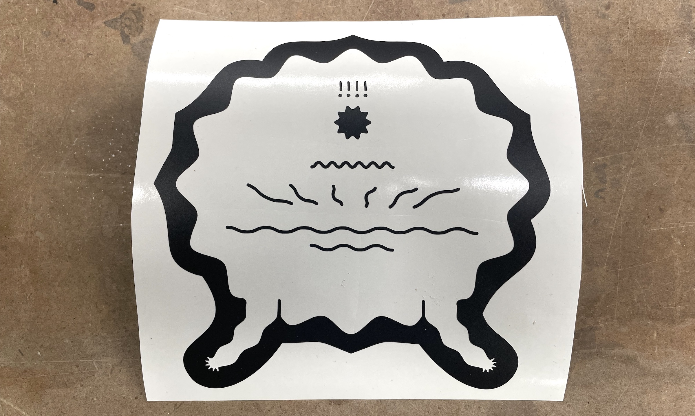

A few things to watch out for:  
* It can help to thoroughly burnish the vinyl with a squeegee before weeding. This can help keep smaller or delicate pieces attached to the backing. Be sure to put a piece of newsprint on top or burnish from the back, to avoid scratching the vinyl  
* The vinyl *really* likes to stick to itself, so it helps to cut large areas into smaller pieces with a knife. Just be careful you don't go through the backing paper or into your design  
* Watch out for really little parts, like the dot in the letter `i`  
* If you find the background wants to stay connected to your design, you can adjust the cut force on the machine and try cutting again  

With your design weeded, the last step is to apply transfer tape. Basically a big roll of masking tape, transfer tape temporarily holds your design while you remove the backing, exposing the vinyl's adhesive so you can apply it to your surface. Then we remove the transfer tape and voila... you're done! This process can take some practice and is definitely easier with someone helping you.

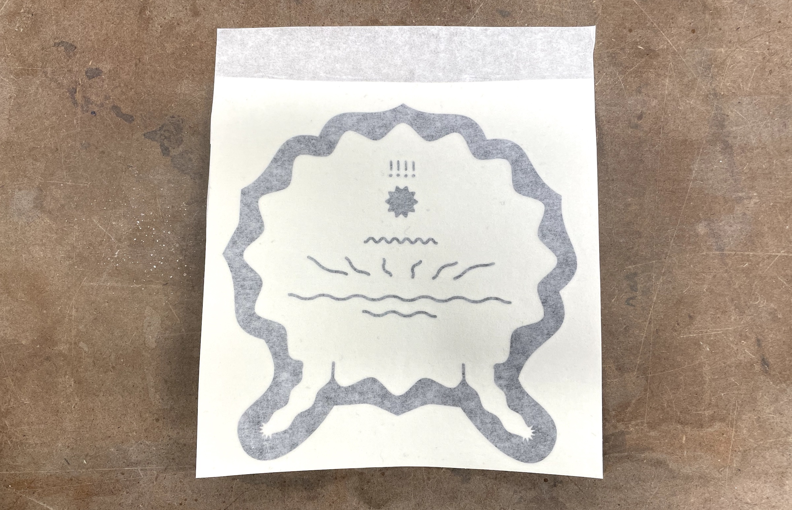

To apply the tape:  
1. Make sure your vinyl and work surface are super clean – dust and crud can cause problems!  
2. Unroll about `6 inches` of tape, then carefully apply it to the table in a narrow strip. For smaller pieces, you can just cut off a piece of tape to cover the whole design    
3. Insert your vinyl, then apply the tape to the edge – this sticks everything to the table and keeps things from moving around  
4. Carefully unroll more tape, then use the squeegee or your hands to apply it, avoiding air bubbles  
5. Continue the process until you reach the end of your vinyl  
6. Cut the tape off, then burnish with the squeegee very thoroughly  
7. Trim any excess tape from your design, leaving `1–2 inches` at the top so you can stick it down when applying the vinyl  

Transfer tape is included in the cost of vinyl in the Fab Lab. If you brought your own vinyl, you can purchase it. Currently, we only offer the masking tape style of transfer tape, but specialty versions also exist such as clear, which is used for multi-color designs.

- - -

### APPLYING THE VINYL

> Photos and details coming shortly!

- - -

### OTHER RESOURCES  
Find something useful? Please send it to me and I'll add it to the list!

* A [nice video tutorial](https://www.youtube.com/watch?v=7s6wfeygYmI) on how to create multi-color vinyl (this shows the cutting using a Cricut, but the same basic ideas apply)  

