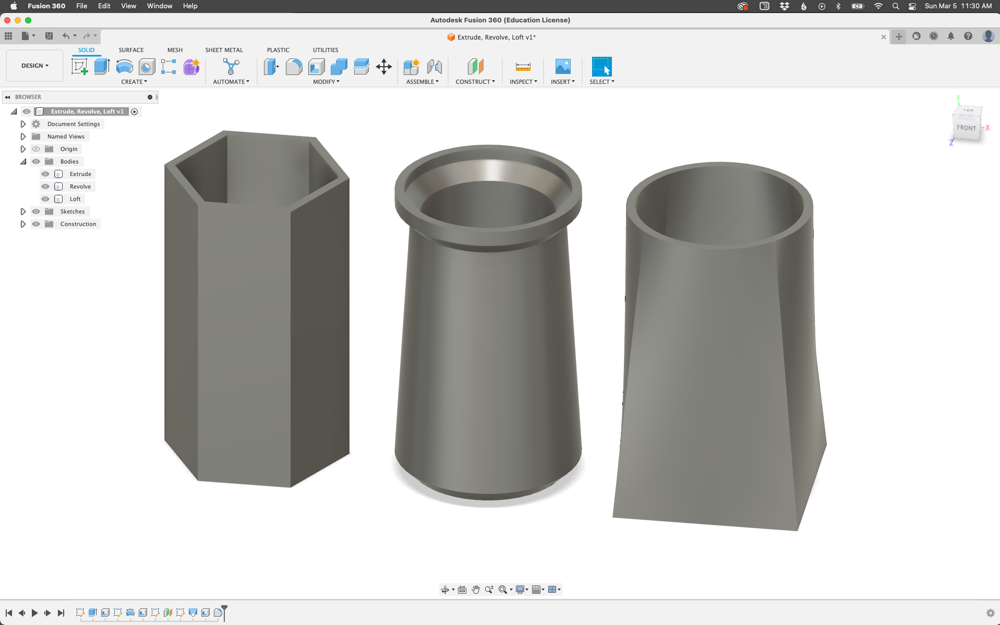

# VASES: EXTRUDE, REVOLVE, LOFT

### TLDR

* Due March 20  
  * Take a screenshot of your vase forms and upload to Canvas  
* Create three vase forms in Fusion 360  
  * One using the `extrude` command, one using `revolve`, and one `loft`  
  * Use the `shell` command to make them hollow if necessary  
* We'll 3D print one of your vases in the Fab Lab  

- - -

### OVERVIEW  
To get familiar with creating three-dimensional objects in Fusion 360, we'll start by making vase forms. You should design three vases: one using the `extrude` command, one using `revolve`, and one with `loft`. Then use the `shell` command to make them hollow (or try doing this with the geometry and 3D commands instead). These basic modeling ideas will be used throughout the semester to create more complex projects. Think about what these three commands do well (and don't) and how you can use them to create interesting three-dimensional forms. You can also draw on the historical examples we found in class for inspiration. The goal should be three visually interesting vase forms (and for you to get more comfortable with Fusion 360).

> See the `Images` folder here for screenshots showing each process, or [view the sample project right in Fusion 360](https://a360.co/3kJwMZR)! If you've used Fusion or done 3D modeling before, please only use the tools we looked at in class – be creative within those limitations!

When finished, take a screenshot of your three vase forms and upload to Canvas. In class next week, we'll look at how to export a `stl` file from Fusion and how to prep it for the 3D printer.

- - -

### WHY FUSION 360?  
There are lots of software capable of creating 3D models that we could print. Tools like Cinema 4D, ZBrush, and Blender are wonderful for more organic shapes and for animation. SketchUp and Rhino are similar to Fusion, but have some limitations. Fusion 360 is incredibly complex and powerful software, which can make it intimidating. But it's also now an industry standard for digital fabrication and is well worth the somewhat steeper learning curve. Plus, it's free for educational and non-commercial users!

There are lots more "under the hood" reasons that Fusion is ideal for our work, but later in the semester you're welcome to try other software.

